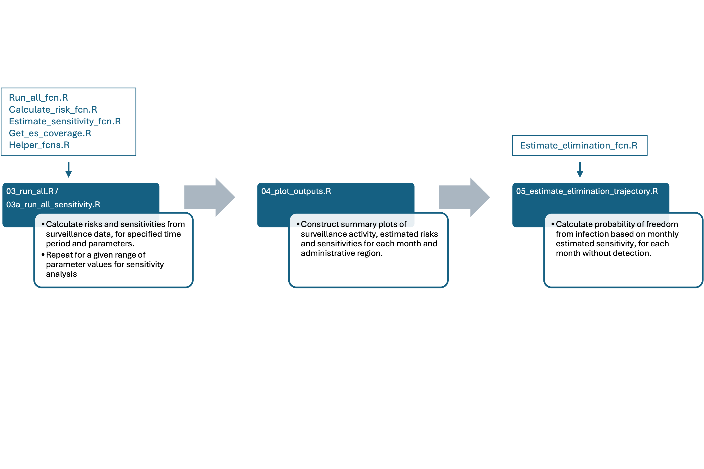

# Sub-national estimation of surveillance sensitivity to inform declaration of disease elimination

This repository provides code to conduct an analysis of polio surveillance data, assessing risk, sensitivity of poliovirus detection and the probability of elimination from a bounded region. It builds upon principles described in [O'Reilly et al 2020](https://pubmed.ncbi.nlm.nih.gov/32398193/) and the data cleaning and immunity modelling in [Voorman et al 2023](https://pubmed.ncbi.nlm.nih.gov/34483024/). The analysis approach is described in full in [Nightingale et al (2025)](https://www.medrxiv.org/content/10.1101/2025.01.30.25321401v1), along with the results of a validation against the evaluation of wild poliovirus elimination in Nigeria between 2014 and 2020.

## Data

In order to demonstrate the analysis approach, example datasets of randomised values are included in the folder *inputs/test*. These data are linked to shapefiles and population estimates for Nigerian Local Government Authorities obtained from [WorldPop](https://eprints.soton.ac.uk/452722/).

### Before running

Gridded (100m) estimates of population counts are also required to calculate approximate catchment sizes around point locations of environmental sampling sites. These are obtained from the same [WorldPop](https://eprints.soton.ac.uk/452722/) source but need to be downloaded manually and saved into the *inputs/test* directory as *worldpop_raster_test.tif* due to the large file size.

The provided test data consist of:

-   **es.rds:** Linelist of (randomised) ES samples and outcomes

-   **afp.rds:** Linelist of (randomised) AFP samples and outcomes

-   **data.rds:** Aggregated counts per month/LGA of ES samples and positives, AFP samples and positives, total/under-5/under-15 population count and immunity (as estimated by [Voorman et al 2023](https://doi.org/10.1016/j.vaccine.2022.03.013)).

-   **shape0/1/2:** Administrative boundary shapefiles sourced from WorldPop.

-   **R.rds:** Matrix of weights representing the radiation model between LGAs, for calculation of spatially-correlated risk.

Note that these data have been created to reflect the structure of the real data and to allow users to test the code, but **do not** represent real surveillance observations. The analysis presented in the above manuscripts is based on data provided by the Global Polio Eradication Initiative according to a data sharing agreement with the London School of Hygiene and Tropical Medicine.

## Code

The analysis consists of seven scripts, of which the first two are data cleaning and setup for the real data described in Nightingale et al. and not relevant if using the provided test data (already set up to begin running *02_descriptive_plots.R*).

The main analysis is conducted via four primary scripts and six functions:

# polio-ffi-model
